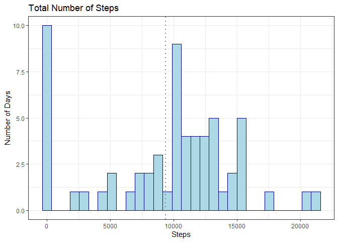
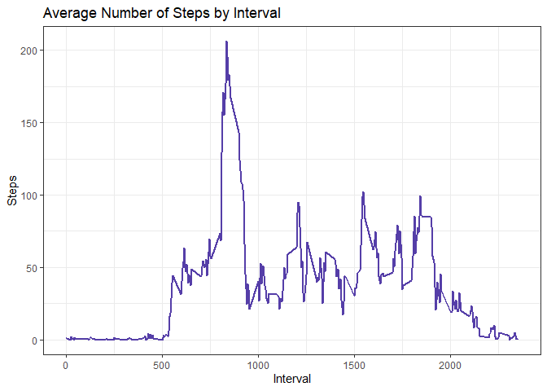

## Loading and preprocessing the data


```r
activity<-read.csv("activity.csv")
```


## What is mean total number of steps taken per day?

The data is first summarized and then added to a new data frame

```r
echo=TRUE
steps<-tapply(activity$steps, activity$date, FUN=sum, na.rm=TRUE)
dates<-unique(activity$date)
stepssum<-data.frame(Steps=steps, Date=dates)
```

The graph is made and the mean is signified by a dotted grey line

```r
echo=TRUE
library(ggplot2)
a<-ggplot(stepssum,aes(x= Steps))
a+geom_histogram(color="darkblue", fill="lightblue")+
    labs(y="Number of Days", title = "Total Number of Steps")+
    geom_vline(aes(xintercept=mean(stepssum$Steps)), size=1, linetype=3, color="#878787")+
    theme_bw()
```

```
## Warning: Using `size` aesthetic for lines was deprecated in ggplot2 3.4.0.
## ℹ Please use `linewidth` instead.
```

```
## `stat_bin()` using `bins = 30`. Pick better value with `binwidth`.
```

<!-- -->

The mean total number of steps taken per day is:

```r
echo=TRUE
x<-mean(stepssum$Steps)
print(x)
```

```
## [1] 9354.23
```

## What is the average daily activity pattern?

The data is first summarized and then added to a new data frame

```r
daily<-tapply(activity$steps, activity$interval, FUN = mean, na.rm=TRUE)
intervals<-unique(activity$interval)
avg<-data.frame(Steps=daily, Interval=intervals)
```

The graph showing the average number of steps over the course of all the intervals:

```r
b<-ggplot(avg,aes(x=Interval,y=Steps))
b+geom_line(color="#553ea8", size=1)+
    labs(title = "Average Number of Steps by Interval")+
    theme_bw()
```

<!-- -->

The interval at which the highest average number of steps occur:

```r
y<-max(avg$Steps)
print(avg[which.max(avg$Steps) , ])
```

```
##        Steps Interval
## 835 206.1698      835
```

## Imputing missing values


## Are there differences in activity patterns between weekdays and weekends?
