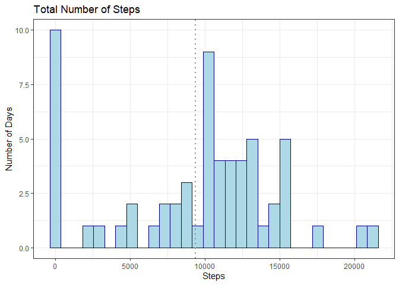
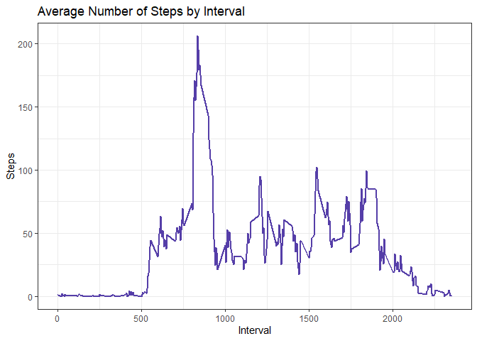
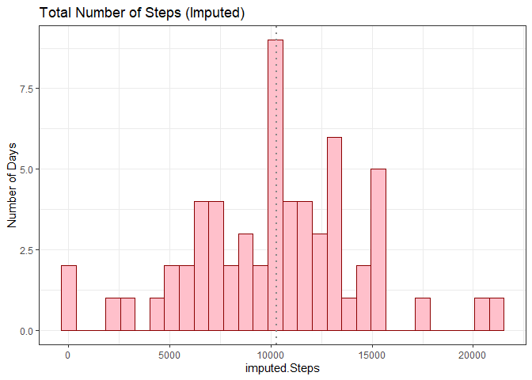
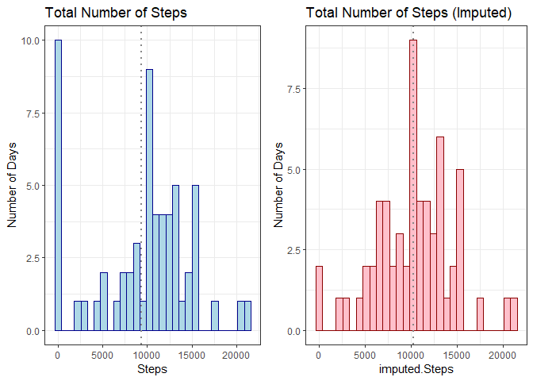
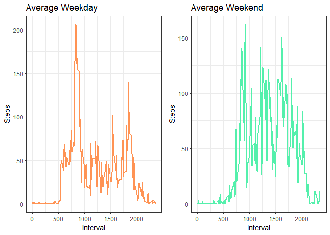

```r
library(ggplot2)
library(mice)
```

```
## 
## Attaching package: 'mice'
```

```
## The following object is masked from 'package:stats':
## 
##     filter
```

```
## The following objects are masked from 'package:base':
## 
##     cbind, rbind
```

```r
library(dplyr)
```

```
## 
## Attaching package: 'dplyr'
```

```
## The following objects are masked from 'package:stats':
## 
##     filter, lag
```

```
## The following objects are masked from 'package:base':
## 
##     intersect, setdiff, setequal, union
```

```r
library(cowplot)
```

## Loading and preprocessing the data


```r
activity<-read.csv("activity.csv")
```


## What is mean total number of steps taken per day?

The data is first summarized and then added to a new data frame

```r
echo=TRUE
steps<-tapply(activity$steps, activity$date, FUN=sum, na.rm=TRUE)
dates<-unique(activity$date)
stepssum<-data.frame(Steps=steps, Date=dates)
```

The graph is made and the mean is signified by a dotted grey line

```r
echo=TRUE
library(ggplot2)
a1<-ggplot(stepssum,aes(x= Steps))+
    geom_histogram(color="darkblue", fill="lightblue", position = "identity")+
    labs(y="Number of Days", title = "Total Number of Steps")+
    geom_vline(aes(xintercept=mean(stepssum$Steps)), size=1, linetype=3, color="#878787")+
    theme_bw()
```

```
## Warning: Using `size` aesthetic for lines was deprecated in ggplot2 3.4.0.
## ℹ Please use `linewidth` instead.
```

```r
a1
```

```
## `stat_bin()` using `bins = 30`. Pick better value with `binwidth`.
```

<!-- -->

The mean total number of steps taken per day is:

```r
echo=TRUE
x<-mean(stepssum$Steps)
y<-median(stepssum$Steps)
paste("Mean:",x)
```

```
## [1] "Mean: 9354.22950819672"
```

```r
paste("Median:",y)
```

```
## [1] "Median: 10395"
```

## What is the average daily activity pattern?

The data is first summarized and then added to a new data frame

```r
echo=TRUE
daily<-tapply(activity$steps, activity$interval, FUN = mean, na.rm=TRUE)
intervals<-unique(activity$interval)
avg<-data.frame(Steps=daily, Interval=intervals)
```

The graph showing the average number of steps over the course of all the intervals:

```r
echo=TRUE
b<-ggplot(avg,aes(x=Interval,y=Steps))
b+geom_line(color="#553ea8", size=1)+
    labs(title = "Average Number of Steps by Interval")+
    theme_bw()
```

<!-- -->

The interval at which the highest average number of steps occur:

```r
echo=TRUE
y<-max(avg$Steps)
print(avg[which.max(avg$Steps) , ])
```

```
##        Steps Interval
## 835 206.1698      835
```

## Imputing missing values

The number of missing values in the data set: 

```r
echo=TRUE
sum(is.na(activity$steps)>0)
```

```
## [1] 2304
```

To imput the missing values, I am going to use the MICE package. I will use the PMM (Predictive Mean Matching) method.

First, we look at the missing values and where they are in the data

```r
echo=TRUE
library(mice)
activity_numeric<-activity %>%
    select(steps, date, interval)

md.pattern(activity_numeric)
```

<!-- -->

```
##       date interval steps     
## 15264    1        1     1    0
## 2304     1        1     0    1
##          0        0  2304 2304
```

Now we create a new data set with the original steps data and the imputed data

```r
echo=TRUE
mice_imputed<- data.frame(
    original=activity$steps,
    imputed=complete(mice(activity_numeric,method = "pmm"))$steps,
    date = activity$date,
    interval = activity$interval
)
```

```
## 
##  iter imp variable
##   1   1  steps
##   1   2  steps
##   1   3  steps
##   1   4  steps
##   1   5  steps
##   2   1  steps
##   2   2  steps
##   2   3  steps
##   2   4  steps
##   2   5  steps
##   3   1  steps
##   3   2  steps
##   3   3  steps
##   3   4  steps
##   3   5  steps
##   4   1  steps
##   4   2  steps
##   4   3  steps
##   4   4  steps
##   4   5  steps
##   5   1  steps
##   5   2  steps
##   5   3  steps
##   5   4  steps
##   5   5  steps
```

```
## Warning: Number of logged events: 1
```

```r
str(mice_imputed)
```

```
## 'data.frame':	17568 obs. of  4 variables:
##  $ original: int  NA NA NA NA NA NA NA NA NA NA ...
##  $ imputed : int  0 0 0 0 0 0 0 0 0 0 ...
##  $ date    : chr  "2012-10-01" "2012-10-01" "2012-10-01" "2012-10-01" ...
##  $ interval: int  0 5 10 15 20 25 30 35 40 45 ...
```

Summarize the imputed data by day:

```r
echo=TRUE
imsteps<-tapply(mice_imputed$imputed, mice_imputed$date, FUN=sum, na.rm=TRUE)
dates<-unique(mice_imputed$date)
imstepssum<-data.frame(imputed.Steps=imsteps, Date=dates)
head(imstepssum)
```

```
##            imputed.Steps       Date
## 2012-10-01          6797 2012-10-01
## 2012-10-02           126 2012-10-02
## 2012-10-03         11352 2012-10-03
## 2012-10-04         12116 2012-10-04
## 2012-10-05         13294 2012-10-05
## 2012-10-06         15420 2012-10-06
```

Graphing the imputed data

```r
echo=TRUE
library(ggplot2)
a2<-ggplot(imstepssum,aes(x= imputed.Steps))+
    geom_histogram(color="darkred", fill="pink", position = "identity")+
    labs(y="Number of Days", title = "Total Number of Steps (Imputed)")+
    geom_vline(aes(xintercept=mean(imstepssum$imputed.Steps)), size=1, linetype=3, color="#878787")+
    theme_bw()
a2
```

```
## `stat_bin()` using `bins = 30`. Pick better value with `binwidth`.
```

<!-- -->

The original data vs the imputed data:

```r
echo=TRUE
library(cowplot)
plot_grid(a1,a2)
```

```
## `stat_bin()` using `bins = 30`. Pick better value with `binwidth`.
## `stat_bin()` using `bins = 30`. Pick better value with `binwidth`.
```

<!-- -->

The mean and median of each set is:

```r
echo=TRUE
x<-mean(stepssum$Steps)
y<-median(stepssum$Steps)
m<-mean(imstepssum$imputed.Steps)
n<-median(imstepssum$imputed.Steps)
z<-data.frame(Mean=c(x,m),Median=c(y,n))
row.names(z)<-c("Original","Imputed")
z
```

```
##              Mean Median
## Original  9354.23  10395
## Imputed  10264.84  10395
```

## Are there differences in activity patterns between weekdays and weekends?

First the data needs to be reformatted to make the plots:

```r
echo=TRUE
mice_imputed$date<-as.Date(mice_imputed$date)
Day<-weekdays(mice_imputed$date)
mice_imputed<-cbind(mice_imputed,Day)
mice_imputed<-mutate(mice_imputed, Weekday = ifelse(Day=="Monday"|Day=="Tuesday"|Day=="Wednesday"|Day=="Thursday"|Day=="Friday","Y","N"))
str(mice_imputed)
```

```
## 'data.frame':	17568 obs. of  6 variables:
##  $ original: int  NA NA NA NA NA NA NA NA NA NA ...
##  $ imputed : int  0 0 0 0 0 0 0 0 0 0 ...
##  $ date    : Date, format: "2012-10-01" "2012-10-01" ...
##  $ interval: int  0 5 10 15 20 25 30 35 40 45 ...
##  $ Day     : chr  "Monday" "Monday" "Monday" "Monday" ...
##  $ Weekday : chr  "Y" "Y" "Y" "Y" ...
```

The weekday data and the weekend data is separated:

```r
echo=TRUE
MF<-subset(mice_imputed, Weekday=="Y")
SS<-subset(mice_imputed, Weekday=="N")
```

Summarizing each set of data seperately:

```r
echo=TRUE
sumMF<-tapply(MF$imputed, MF$interval, FUN = mean, na.rm=TRUE)
intervals<-unique(MF$interval)
avgMF<-data.frame(Steps=sumMF, Interval=intervals)

sumSS<-tapply(SS$imputed, SS$interval, FUN = mean, na.rm=TRUE)
avgSS<-data.frame(Steps=sumSS, Interval=intervals)
```

Graphing the Weekday and Weekend data:

```r
echo=TRUE
w1<-ggplot(avgMF,aes(x=Interval,y=Steps))+
    geom_line(color="#ff9354", size=1)+
    labs(title = "Average Weekday")+
    
    theme_bw()

w2<-ggplot(avgSS,aes(x=Interval,y=Steps))+
    geom_line(color="#54f0ac", size=1)+
    labs(title = "Average Weekend")+
    theme_bw()

plot_grid(w1,w2)
```

<!-- -->


